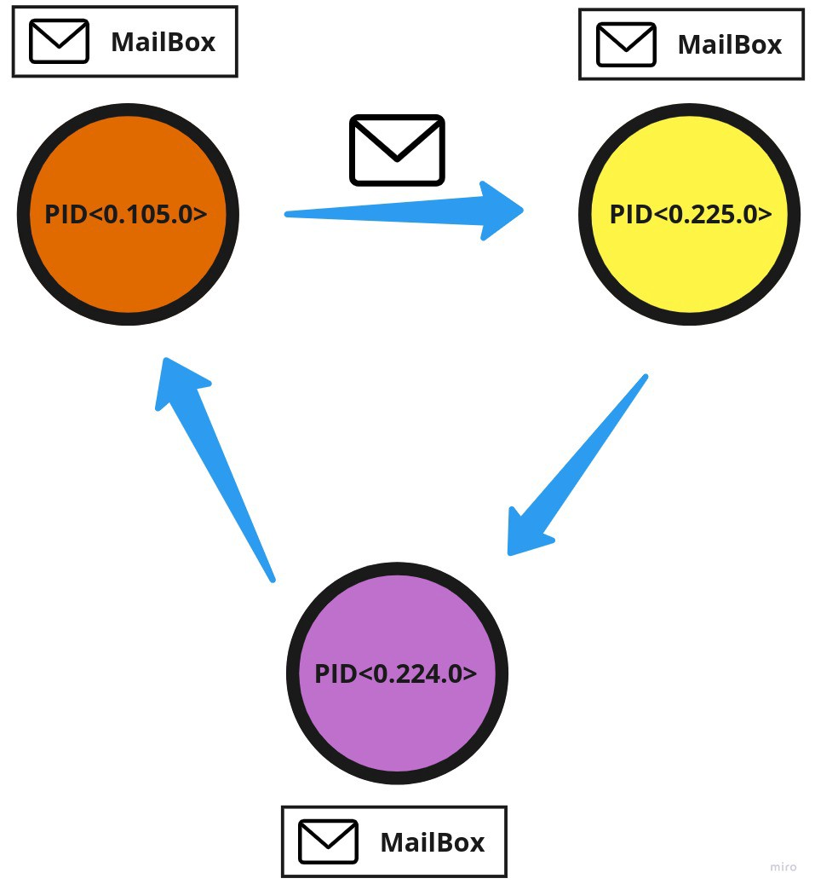
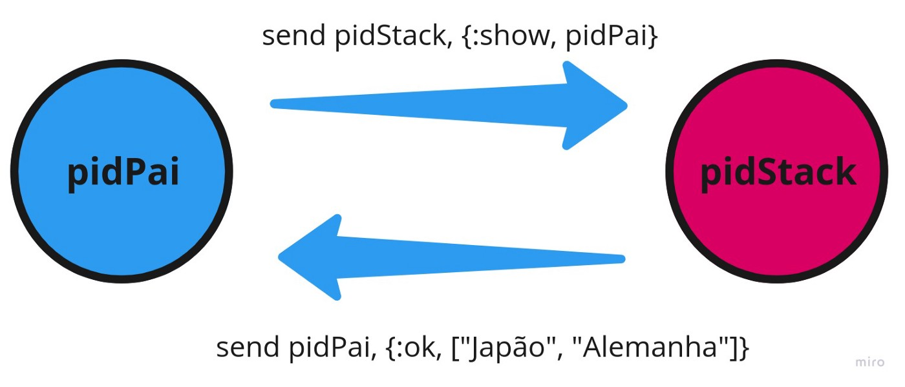
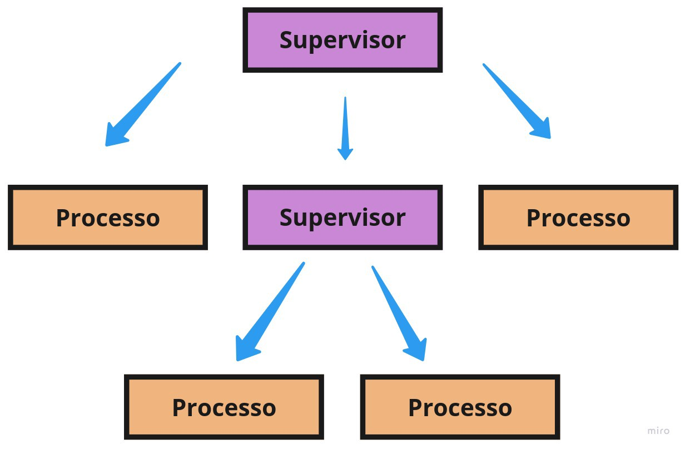
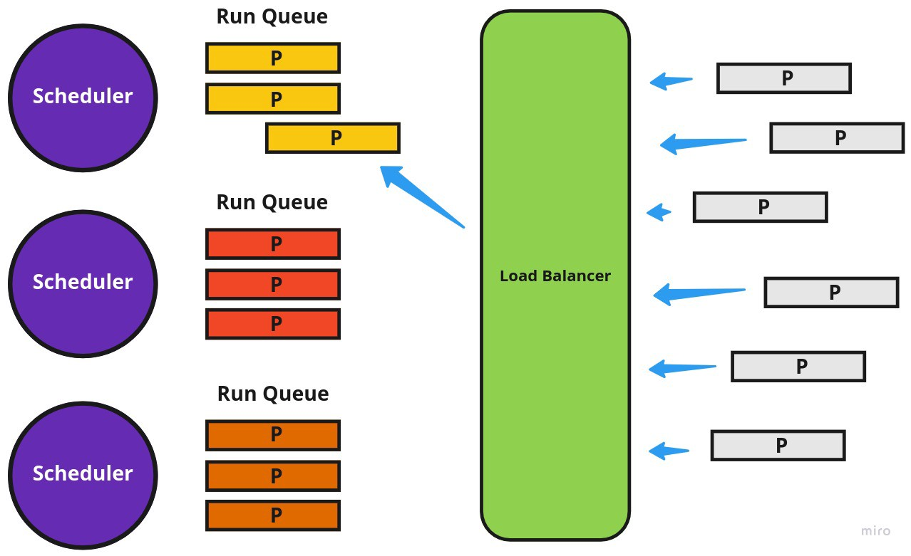

Há alguns meses venho estudando **Elixir**, e com ele me deparei com vários conceitos ligados à linguagem. Entre esses conceitos, encontra-se uma das bases da linguagem: seu modelo de **concorrência**.

Elixir é uma linguagem funcional que compila para bytecode que executa em uma máquina virtual chamada **BEAM**, máquina virtual **Erlang**, sendo Erlang uma linguagem criada há mais de 30 anos no setor de telecomunicações. Claro que Erlang/Elixir pode ser usado para quaisquer fins, mas sua herança neste setor formou a base de seu sistema de concorrência e tolerância a falhas.

---

### Modelo de atores

No dia a dia como programador, nos deparamos com alguns modelos de concorrência, **javascript** com event-loop ou **java** com threads. Porém no Elixir usamos um modelo conhecido como **modelo de atores**.

Um ator em Elixir é um **processo Erlang** (não confundir com processos do sistema operacional). Esses processos Erlang tem como características principais duas coisas: eles **não compartilham** a mesma memória, no caso são totalmente isolados dos outros processos, tendo seu estado **privado**, que nunca pode ser **alterado** por outro processo diretamente; eles se **comunicam** passando mensagens uns com os outros.

Para que essa comunicação funcione, cada ator ou processo Erlang possui um “endereço” que nesse caso é um **PID**. Cada processo também possui uma mailbox que salva as mensagens recebidas em forma de **queue** (fila).



Toda a troca de mensagens entre os atores/processos é feita de forma assíncrona usando a função `send/2` e para lidarmos com as mensagens recebidas ou que vamos receber usamos a macro `receive`.

Como todo código Elixir roda em um processo, podemos demostrar as funções **send** e **receive** na prática usando o **REPL** do Elixir o iex:

```elixir
iex> pid = self() # pega o pid atual do processo
#PID<0.105.0>
iex> send pid,{:ok, "mensagem com padrão 1"}
iex> send pid,{:ok, "mensagem com padrão 2"}
iex> Process.info pid, :messages # mostra as mensagens salvas na mailbox
{:messages, [ok: "mensagem com padrão 1", ok: "mensagem com padrão 2"]}
iex> receive do {:ok, msg} -> IO.puts msg end # macro que lida com as mensagens
mensagem com padrão 1
:ok
iex> Process.info pid, :messages
{:messages, [ok: "mensagem com padrão 2"]}
```

No exemplo acima, usamos a função `self/0` para pegar o PID do processo atual, e usando a função `send/2` enviamos duas mensagens para nosso processo principal. Veja o primeiro parâmetro de send é o PID do processo, e seu segundo parâmetro é a mensagem. Essa mensagem pode ser em qualquer formato ou estrutura de dados, no caso do exemplo, usamos **tuplas**. Para recuperar as mensagens salvas na mailbox do processo usamos a macro `receive`. Sua funcionalidade é bastante simples, nela escrevemos pattern matching que vai lidar com a **queue** de mensagens da mailbox. Se um receive der match em **uma** mensagem, ele vai executar as regras computacionais ligadas a essa mensagem como mostrado no exemplo acima, que ao dar **match** na mensagem chamamos a função `IO.puts/1` retornando a mensagem para o processo. Se `receive` não der match com qualquer mensagem na mailbox, ela vai bloquear o processo, esperando por uma mensagem que possa dar match. Para evitar esse bloqueio podemos definir um timeout que expressa o tempo limite de bloqueio a espera de um match. Veja abaixo um exemplo usando `after` para definir nosso timeout.

```elixir
iex> receive do
...>  msm -> msm
...> after
...>  1000 -> "nada aconteceu depois de 1s"
...> end
"nada aconteceu depois de 1s"
```

Podemos criar outros processos Erlang usando a função `spawn/1` ou `spawn/3`. Vamos a um exemplo usando `spawn/1`:

```elixir
iex> pid = spawn fn -> 5 + 5 end
iex> Process.alive? pid
false
```

No exemplo acima, criamos um processo com `spawn/1`, essa função nos devolve o PID deste processo criado. A função de soma (5 + 5) é executada nesse processo isolado, e quando finalizada, o processo que criamos deixa de existir. Podemos verificar se um processo existe pelo método `Process.alive?/1`.

Mas você deve estar se perguntando: Quando usar processos? A resposta dessa pergunta não é muito diferente em comparação com outras linguagens que buscam concorrência em suas operações. Buscamos concorrência para **lidar** com coisas ao mesmo tempo, como acessar uma api externa ou ler algo no disco, algo que lida com I/O bound, e no espaço de espera entre as operações I/O podemos seguir executando outros códigos, pois não necessitamos da dependência sequencial dos dados. E em Elixir podemos usar os processos para lidar e salvar estado mutável ou para código concorrente.

### Lidando com estado usando processos

Elixir é uma **linguagem funcional**, sendo funcional ela também é imutável. Os dados são **imutáveis**. Porém podemos manter estado usando processos. Mantemos estado em um processo elixir usando recursão. Vamos criar um modelo de **stack**(pilha) usando processos na prática. Primeiro vamos criar um novo projeto: `mix new process_in_elixir`

Crie um arquivo na pasta lib chamado stack_normal.ex.

```elixir
defmodule ProcessInElixir.StackNormal do
  def start_link(initialStack \\ []) do
    pid = spawn_link __MODULE__, :loop, [initialStack]
    {:ok, pid}
  end
  def child_spec(opts) do
    %{
      id: __MODULE__,
      start: {__MODULE__, :start_link, [opts]},
      type: :worker,
      restart: :permanent,
      shutdown: 500
    }
  end
  def loop(stack \\ []) do
    receive do
      {:push, value} ->
        newStack = [value | stack]
        loop newStack
      {:pop, sender} ->
        [head | tail] = stack
        send sender, {:ok, head}
        loop tail
      {:show, sender} ->
        send sender, {:ok, Enum.reverse stack}
      {:raise} ->
        raise "error no processo"
    end
    loop stack
  end
  def push(pid, value), do: send pid, {:push, value}
  def raiseProcess(pid), do: send pid, {:raise}
  def pop(pid) do
    send pid, {:pop, self()}
    receive do {:ok, itemDeleted} -> itemDeleted end
  end
  def show(pid) do
    send pid, {:show, self()}
    receive do {:ok, stack} -> stack end
  end
end
```

Podemos rodar nosso código pelo iex: `iex -S mix`

```elixir
iex> alias ProcessInElixir.StackNormal
ProcessInElixir.StackNormal
iex> {:ok, pid} = StackNormal.start_link
{:ok, #PID<0.326.0>}
iex> StackNormal.push pid, "Japão"
{:push, "Japão"}
iex> StackNormal.push pid, "Alemanha"
{:push, "Alemanha"}
iex> StackNormal.push pid, "Brasil"
{:push, "Brasil"}
iex> StackNormal.pop pid
"Brasil"
iex> StackNormal.show pid
["Japão", "Alemanha"]
```

Podemos notar que usamos a função `spawn_link/3`, sendo o primeiro argumento o módulo do processo; segundo argumento a função recursiva que vai manter o estado e o terceiro argumento uma lista com os valores iniciais da stack. Usando agora nossa função `StackNormal` podemos fazer vários push em nossa **stack**. O interessante é que não estamos mudamos os valores nas variáveis, e sim estamos criando uma nova lista a cada interação com o **loop** do processo. Conseguimos recuperar o valor da nossa **stack** para o processo pai pois enviamos uma mensagem para o PID do process Stack com o PID do processo pai, o receive da Stack da match com esta mensagem, e envia a stack em forma de List para o processo pai, o processo pai por sua vez usa o receive para tratar a mensagem.



Podemos notar que usamos `spawn_link/3` para linkar dois processos. Neste caso linkamos o processo StackNormal com o processo principal da aplicação. Isso significa, que se o StackNormal der crash, o erro vai comprometer também o processo que está ligado a ele. E agora que entramos em uma das partes mais importante do Elixir, seu modelo de tolerância a falhas.

### Tolerância a falhas

Em **Erlang** introduz a filosofia “let it crash”. A ideia é que você não precisa se preocupar tanto em programar defensivamente, tentando antecipar todo tipo de problema que pode ocorrer. Então podemos fazer esse código crítico ser supervisionado por outro processo que tem somente a responsabilidade de lidar com os processos que falham. Os **Supervisor**, são processos que monitoram outros processos, e caso um ou alguns processos possam dar erro, ele implementa estratégias para reiniciar automaticamente esses processos, tentando assim colocá-los novamente em um estado consistente.

Vamos ao código, vamos criar nosso **Supervisor**. Crie o arquivo stack_supervisor.ex.

```elixir
defmodule StackSupervisor do
  use Supervisor
  def start_link(_arg \\ []) do
    Supervisor.start_link __MODULE__, :ok, name: __MODULE__
  end
  def init(:ok) do
    children = [ProcessInElixir.StackNormal]
    Supervisor.init(children, strategy: :one_for_one)
  end
  def which_children(), do: Supervisor.which_children __MODULE__
end
```

Vamos rodar nosso código no iex:

```elixir

iex> StackSupervisor.start_link
{:ok, #PID<0.230.0>}
iex> StackSupervisor.which_children
[
  {ProcessInElixir.StackNormal, #PID<0.231.0>, :worker,
   [ProcessInElixir.StackNormal]}
]
iex> ProcessInElixir.StackNormal.push pid(0,231,0), "Japão"
{:push, "Japão"}
iex> ProcessInElixir.StackNormal.show pid(0,231,0)
["Japão"]
iex> ProcessInElixir.StackNormal.raiseProcess pid(0,231,0)
{:raise}
iex> StackSupervisor.which_children
[
  {ProcessInElixir.StackNormal, #PID<0.237.0>, :worker,
   [ProcessInElixir.StackNormal]}
]
iex> ProcessInElixir.StackNormal.show pid(0,237,0)
[]
```

Como demos ver acima, iniciamos um **Supervisor**, criamos um children usando nosso processo **StackNormal**. Usando o método `which_children` podemos ver os processos linkados a nosso Supervisor, com ele vemos um PID já iniciado da **StackNormal**. Damos um push e show para averiguar se os dados estão sendo salvos. Agora, vamos usar a função `raiseProcess/0` da StackNormal para produzir um erro no processo. Quando este erro acontece, o **Supervisor**, simplesmente reinicia outro processo no lugar do que foi corrompido. Podemos notar isso chamando novamente `which_children`, o processo foi reiniciado, podemos notar que seu PID foi alterado também. Se chamarmos show para esse novo PID, veremos que o estado está limpo, no caso é retornando um List vazio.

Podemos usar várias estratégias, como adicionar um supervisor em outro supervisor, ou mesmo adicionar por demanda processos usando **[DynamicSupervisor](https://hexdocs.pm/elixir/DynamicSupervisor.html)**. Toda essa arquitetura de ter supervisores supervisionando outros processos ou mesmo supervisores é conhecido como **Árvore de supervisão**(supervision tree).



---

### Abstrações: Agent, Task e GenServer

Em nossos exemplos para a criação de processos e a comunicação com eles, usamos funções como: `spawn/1`, `send/2` e `receive`. Porém o Elixir provê abstrações que facilitam a criação dos processos.

Podemos usar **Agent** quando queremos apenas lidar com estado. Para tarefas que rodem em paralelo ou concorrentemente com outras tarefas podemos usar **Task**. Ou podemos usar o **GenServer** para lidar com estado e para lidar com tarefas complexas como tarefas concorrentes.

Criei um repositório, com vários exemplos usando Agent, Task e GenServer:

- **[process-in-elixir](https://github.com/alexandreservian/process-in-elixir)**

---

### Como isso tudo funciona no Elixir

Bem quando inciamos a máquina virtual do Erlang, a **BEAM**, ela cria uma **thread** por core. E em cada **thread** ela cria um **scheduler**. E cada **scheduler** vai lidar com sua própria **run queue** contendo processos. O **scheduler** retira um processos da sua **run queue** e aloca um “pedaço de tempo”. Se o processo exceder seu “pedaço de tempo” o **scheduler** pode pausar esse processo, e colocá-lo de volta na **run queue** e passar para o **próximo** processo da fila.

A **BEAM** também é responsável por encaminhar os processos para as run queues dos **schedulers** disponíveis. Esse gerenciamento é feito pelo **Load Balancer** da BEAM. O **Load Balancer** ajuda a remover processos em schedulers sobrecarregados e entregá-los a **schedulers** vazios. O **load balancer** vista manter o número máximo de processos executáveis iguais entre os **schedulers**.



### Conclusão

Bem, quanto mais estudo e uso Elixir, mais fico empolgado. A forma que ele lida com concorrência é muito interessante. Programação funcional aliada à uma linguagem muito completa e moderna é uma união que agrega e muito nosso ferramental para criar softwares no dia a dia. Vlws.
