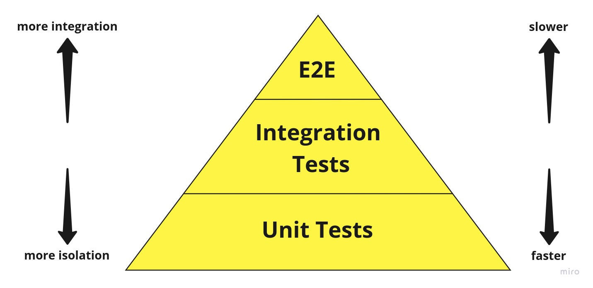

No post [anterior](./testes-em-uma-aplicacao-react-parte-1-testes-unitarios) iniciamos os testes em nossa aplicação react. Passamos por uma definição de **testes unitários** e até vimos como se da o desenvolvimento guiado por testes o **TDD**.

Continuaremos pelo nosso tutorial com a aplicação de **conversão de moedas estrangeiras**. Acesse o [repositório](https://github.com/alexandreservian/foreign-currency-converter) e para continuar de onde paramos desde o post anterior, basta usar `git checkout 1.1.0`.

## O são testes de integração?

Em um sistema podemos ter vários níveis de testes, desde um teste unitário, que testa pequenas partes do nosso código até testes que testam toda aplicação de **ponta a ponta**. Podemos seraparar esses **conjuntos** de testes em uma **forma visual** conhecida como **pirâmide de testes**:

Nela podemos observar que quanto mais alto na pirâmide mais será a **integraçao** do software. Também podemos notar que na base da nossa pirâmide, os testes unitarios são mais rapidos para se desenvolver.

No meio da nossa pirâmide se encontra os testes de **integração**. Esses testes que visam testar a **integração** de classes, módulos ou funções entre si dentro de um **funcionalidade**. No fim avaliam se módulos criados como **unidades** se trabalhados em **conjunto** vão gerar um resultado esperado.

Os testes de integração se **diferem** dos testes **end-to-end**(E2E), pois nos testes E2E testamos **toda** aplicação, por exemplo, ele simula um usuário interagindo em todas as telas de um sistema. Já o teste de integração visa testar somente **uma** funcionalidade do sistema.

### Referências:

- [A pirâmide de testes](https://medium.com/creditas-tech/a-pir%C3%A2mide-de-testes-a0faec465cc2)
- [Pirâmide de Testes — Definindo uma boa suíte de testes para seu Software](https://medium.com/luizalabs/pir%C3%A2mide-de-testes-definindo-uma-boa-su%C3%ADte-de-testes-para-seu-software-a6864886f29b)
- [Como mantemos a qualidade de software nos projetos do Luizalabs](https://medium.com/luizalabs/como-mantemos-a-qualidade-de-software-nos-projetos-do-luizalabs-413814a5c252)
- [How To Test Your React Apps With The React Testing Library](https://www.smashingmagazine.com/2020/07/react-apps-testing-library/)
