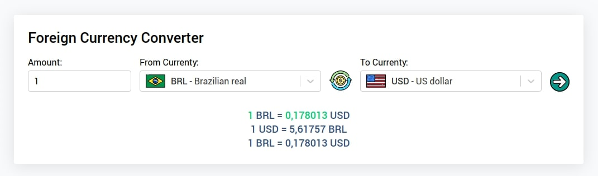
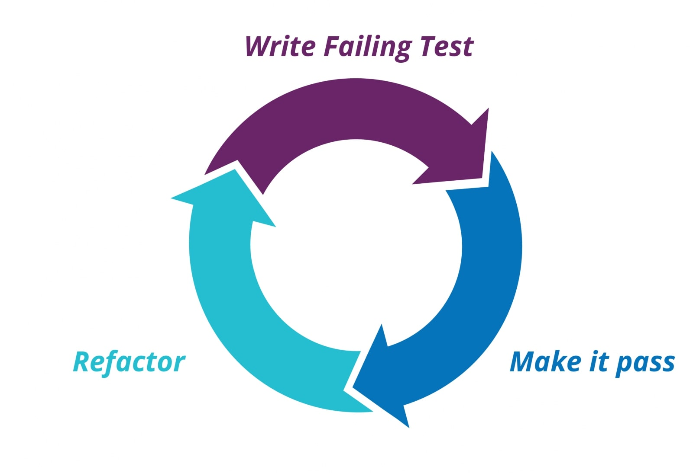
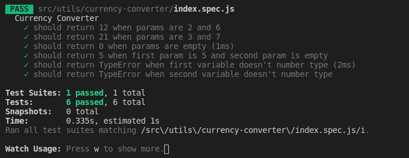

Testar nossas aplicações é algo de exterma importância e agrega muito valor ao produto final que estamos desenvolvendo. Pretendo passar pro alguns topicos relacionados a como testar uma aplicação, usando como exemplo uma pequena aplicação: **conversão de moedas estrangeiras** feita em react.

Abordaremos pontos como **testes unitários**, **testes de integração**, **jest**, **testing-library/react**, **mocks** e testar funcionalidades **assíncronas**.

---

## Antes de começar!!!

Vamos utilizar nessa série de tutoriais, uma pequena aplicação desenvolvida em react. Uma aplicação que converte moedas estrangeiras.



Você pode clonar o projeto **final** pelo seguinte [repositório](https://github.com/alexandreservian/foreign-currency-converter). Para focarmos mais nos testes, todos os componentes já foram criados. E para usar somente os componentes sem os testes, basta utilizar `git checkout 1.0.0`.

Agora somente com todos os componentes em maões podemos começar nosso tutorial :)

> Em todos os testes daqui para frente usaremos **jest**, que é um poderoso **framework** de teste focando na simplicidade. Como estamos usando o **CRA**, ele já vem instalado e configurado com o **jest**.

## O são testes unitários?

Vamos imaginar os **contextos** resumidos de software, suas camadas, suas apis, sua ui quando por exemplo se trabalha com desenvolvimento front-end ou mobile. Nesta grama de contextos de códigos, podemos ter uma **granulação** ainda maior, pois seu programa vai ser escrito a partir de vários pequenos pedaços de outros códigos como **funções** e **classes** que podem interagir entre si. Gosto da analogia da construção de um software relacionado a peças de lego, onde cada peça de lego é uma função ou classe que podemos encaixar umas às outras para criar uma peça maior, e essas peças maiores podem por sua vez se conectar a outras peças menores ou mesmo outras maiores.

Com isso em mente, podemos voltar a nossa pequena unidade de código que deve representar um código de **responsabilidade única**, pois é exatamente nela que se aplicam os **testes unitários**. Esse teste visa testar se uma função ou método de uma classe tem **sempre** uma resultado **constante esperado**. Podemos relacionar simplismente assim: dado um valor **x** como input de uma função, a mesma deve sempre retorna **y** em seu output.

## Criando nosso primeiro teste unitário

Vamos criar na uma nova pasta no projeto em `src` chamada `utils`. Nela vamos criar o código para **converter** nossas moedas selecionadas. Vamos criar uma nova pasta, `currency-converter`, e dentro da mesma crie dois arquivos: `index.js` que vai conter o nosso código e o `index.spec.js` que será nossa suíte de testes.

> **Suíte de testes** se designa para relacionar um **agrupamento** de testes. No **jest** cada arquivo é considerado uma suíte de testes.

> Podemos serapar nossos testes de algumas maneiras, como criar eles dentro de um ditério `__tests__`, ou usando o sufixo `.test` ou `.spec`. Nós em nossos exemplos, optaremos por `.spec`.

Vamos começar pelo nosso arquivo de teste, `index.spec.js`, importando nosso codigo, iniciaremos agrupando nossos testes com a global `describe`. O `describe` não é necessário, porém é interessante quando queremos **organizar** nossos testes em **grupos**.

Dentro do `describe`, criaremos nosso primeiro teste de fato, usando a função `it`. Sendo `it` um **alias** para a função `test`. Vejamos nosso código inicial:

```javascript
import currencyConverter from "./"

describe("Currency Converter", () => {
  it("should return 12 when params are 2 and 6", () => {
    const current = currencyConverter(2, 6)
    const expected = 12

    expect(current).toEqual(expected)
  })
})
```

Criado nosso teste, basta rodar o comando `yarn test`. O teste não irar passar, primeiramente porque não criamos a função e a exportamos no `index.js`. Vamos cria-lo:

```javascript
const currencyConverter = () => {}

export default currencyConverter
```

Rode novamente o teste, e o teste novamente ira quebrar. Bem, esse é um dos principios do **TDD**(desenvolvimento guiado por testes). O foco dessa sequencia de posts não é focar em **TDD**, porém vou ilustra-lo rapidamente. Ele conquiste em um ciclo de desenvolvimento, onde sempre iniciamos nosso desenvolvimento pelos testes. Como iniciamos o desenvolvimento por um teste, o mesmo **não** irá passar. Após escrever o teste e roda-lo, podemos fazer uma pequena implementação que consiste em fazer o teste passar.

```javascript
const currencyConverter = () => 12

export default currencyConverter
```

Para sofrer menos, podemos usar o comando `yarn test --watch` para que a cada alteração em nosso código, o jest rodarar novamente nossos testes. Com essa pequena alteração percebemos que nosso codigo passou. Podemos considerar esse passo somente para rodar nosso teste. Ele é conhecido também como **baby steps**, usado somente para o teste passar. O proximo passo seguindo o TDD será a **refatoração** do nosso código. Criaremos um segundo caso de teste:

```javascript
// currency-converter/index.spec.js
it("should return 21 when params are 3 and 7", () => {
  const current = currencyConverter(3, 7)
  const expected = 21

  expect(current).toEqual(expected)
})
```

Nosso código irá falhar novamente, porém agora vamos refator nosso código com a lógica da conversão, que nada mais é que a quantidade de moeda **multiplicada** pela sua taxa:

```javascript
// currency-converter/index.js
const currencyConverter = (money, rate) => money * rate
```

Agora sim, os dois testes que criamos passaram. Basicamente esse é o ciclo do **TDD**, onde seguimos o seguinte fluxo:

1. Criamos o teste, o teste vai quebrar
2. Escreva um código com o mínimo necessario para que o teste passe(**baby steps**)
3. Se necessario, refatore seu código



Este é o ciclo virtuoso do **TDD**. Podemos criar a quantidade de testes que julgarmos necessários para testar as **possibilidades** de entrada de paramentros em sua **função** e seus **resultados**.

## Criando mais alguns testes a nossa função

Continuando em nossa função, podemos validar outras duas situações interessantes. A primeira que vamos testar é, caso não definirmos os paramentros a função deve retornar **0**:

```javascript
// currency-converter/index.spec.js
it("should return 0 when params are empty", () => {
  const current = currencyConverter()
  const expected = 0

  expect(current).toEqual(expected)
})
```

```javascript
// currency-converter/index.js
const currencyConverter = (money = 0, rate = 0) => money * rate
```

Podemos testar que caso o primeiro paramentro seja preenchido, que representa a **quantidade de moedas** e o segundo que representa a **taxa** não seja enviado, podemos retornar o valor do primeiro paramentro:

```javascript
// currency-converter/index.spec.js
it("should return 5 when first param is 5 and second param is empty", () => {
  const current = currencyConverter(5)
  const expected = 5

  expect(current).toEqual(expected)
})
```

```javascript
// currency-converter/index.js
const currencyConverter = (money = 0, rate = 1) => money * rate
```

Agora para finalizar, podemos **validar** se em ambos os parametros, serão enviados somente números. Caso não seja definido números nos parametros, a função vai retornar um **throw** de **erro** com uma **mensagem** descrevendo o erro. Vamos primeiro ao teste:

```javascript
// currency-converter/index.spec.js
it("should return TypeError when first variable doesn't number type", () => {
  expect(() => currencyConverter("5")).toThrow(
    "The first parameter must be an number type"
  )
})
```

Note que para testar o **matcher** **toThrow** você deve chama-lo dentro de uma outra função `() => currencyConverter("5")`, caso não o faça, o **erro** não vai ser capturado e sua **asserção** vai **falhar**.

> A função `expect` retorna um **objeto** contendo várias funções conhecidas como `matchers`. Os `matchers` são funções com as quais nos possibilitam testar os valores de diferentes **maneiras**. Métodos como `toEqual` e `toThrow` são `matchers`.

Para fazer o teste passar, vamos criar duas novas funções; uma deve se chamar `isNumber`, que retornar um booleano se o valor a ser **validado** é um **número**, e a outra função retorna o **throw** de **erro** e uma **mensagemm** especificando o erro.

Dentro da nossa pasta `utils`, vamos criar a pasta `is-number` e sua `index.js`:

```javascript
const isNumber = variable => typeof variable === "number" && isFinite(variable)

export default isNumber
```

Na mesma pasta vamos criar `generate-type-error` e sua `index.js`:

```javascript
const generateTypeError = (message = "") => {
  throw new TypeError(message)
}

export default generateTypeError
```

> Note que eu não usei **TDD** ao criar as duas novas funções, visto que o post ficaria muito **extenso**. Porém no **repositorio**, eu irei adicionar todos os testes de cada uma função.

Agora vamos para a **refatoração** da nossa função `currencyConverter`:

```javascript
// currency-converter/index.js
import isNumber from "utils/is-number"
import generateTypeError from "utils/generate-type-error"

const currencyConverter = (money = 0, rate = 1) => {
  return !isNumber(money)
    ? generateTypeError("The first parameter must be an number type")
    : money * rate
}
```

Podemos criar mais um teste, para testar o segundo parametro e em seguinda a refatoração da função:

```javascript
// currency-converter/index.spec.js
it("should return TypeError when second variable doesn't number type", () => {
  expect(() => currencyConverter(5, "7")).toThrow(
    "The second parameter must be an number type"
  )
})
```

```javascript
// currency-converter/index.js
const currencyConverter = (money = 0, rate = 1) => {
  return !isNumber(money)
    ? generateTypeError("The first parameter must be an number type")
    : !isNumber(rate)
    ? generateTypeError("The second parameter must be an number type")
    : money * rate
}
```

---

## Conclusão

Bem, podemos observar que todos os testes criados para a função `currencyConverter` passaram:



Até esse ponto da nossa primeira parte, passamos por tópicos como:

- Testes unitários
- TDD
- Jest

Todos os códigos **até** essa etapa estão neste [repositório](https://github.com/alexandreservian/foreign-currency-converter) na versão `1.1.0`(`git checkout 1.1.0`).

### Referências:

- [Anatomia de um teste em JavaScript](https://gabrieluizramos.com.br/anatomia-de-um-teste-em-javascript)
- [Pensando TDD com Javascript](https://blog.da2k.com.br/2015/01/06/pensando-tdd-com-javascript/)
